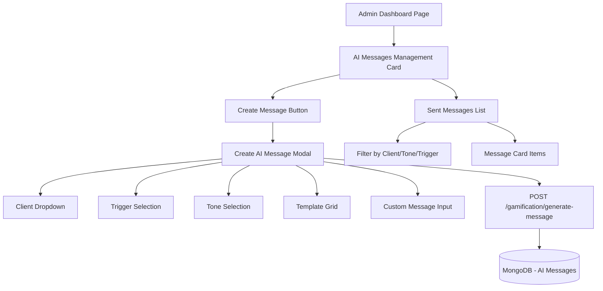

# AI Messages Management

- Admin Dashboard Widget

## Pregled

Implementirati kompletan AI Messages Management sistem u admin dashboard-u koji omogućava:

- Slanje AI poruka klijentima (template-based ili custom)
- Odabir klijenta, tone-a, trigger-a
- Quick templates sa predefinisanim porukama
- Pregled svih poslatih poruka sa filterima
- UX konzistentan sa postojećim admin widget-ima

---

## Arhitektura



---

## Frontend Implementacija

### 1. AI Messages Management Card Widget

**Fajl:** `lib/presentation/pages/admin_dashboard/widgets/ai_messages_management_card.dart`**Struktura (konzistentna sa user_management_card.dart):**

- GradientCard wrapper
- Header: Ikona (smart_toy_rounded) + "AI Messages"
- "Create Message" button (NeonButton)
- Search bar za pretragu poruka
- Filter chips: All, Motivational, Warning, Aggressive, Empathetic
- Lista poslatih poruka (scroll view)

**Props:**

```dart
final VoidCallback onCreateMessage;
final ValueChanged<String> onSearchChanged;
final String toneFilter; // 'ALL', 'MOTIVATIONAL', 'WARNING', 'AGGRESSIVE', 'EMPATHETIC'
final ValueChanged<String> onToneFilterChanged;
final bool isLoading;
final List<AIMessage> messages;
```

---

### 2. Create AI Message Modal

**Fajl:** `lib/presentation/pages/admin_dashboard/modals/create_ai_message_modal.dart`**Sekcije:**

#### A) Client Selection

```dart
DropdownButtonFormField<String>(
  decoration: InputDecoration(
    labelText: 'Select Client',
    prefixIcon: Icon(Icons.person_rounded),
  ),
  items: clients.map((client) => DropdownMenuItem(
    value: client.serverId,
    child: Text('${client.name} (${client.email})'),
  )),
)
```


#### B) Message Type Toggle

```dart
// Dva tab-a: "Quick Templates" i "Custom Message"
TabBar(
  tabs: [
    Tab(text: 'Quick Templates'),
    Tab(text: 'Custom Message'),
  ],
)
```


#### C) Quick Templates Tab

**Template Grid (4 kategorije):**

1. **MISSED_WORKOUTS** (tone: WARNING ili AGGRESSIVE)

- Predlozi:
    - "Propustio si {missedCount} treninga ove nedelje. Vrati se u ritam!"
    - "{missedCount} propuštena treninga? To nisu rezultati koje očekujemo."
    - "Vreme je da se vratiš. {missedCount} treninga čeka."

2. **STREAK** (tone: MOTIVATIONAL)

- Predlozi:
    - "{streak} dana uzastopno! Nastavi ovim tempom, šampione!"
    - "Neverovatnih {streak} dana! Ovo je prava disciplina!"
    - "{streak} dana bez propuštanja - ti si mašina!"

3. **WEIGHT_SPIKE** (tone: WARNING)

- Predlozi:
    - "Težina ti je porasla {weightChange}kg ove nedelje. Hajde da razgovaramo."
    - "+{weightChange}kg? Vreme je za objašnjenje šta se dešava."
    - "Značajna promena: +{weightChange}kg. Check-in potreban."

4. **SICK_DAY** (tone: EMPATHETIC)

- Predlozi:
    - "Osećaš se bolesno? Prvo zdravlje. Oporavi se i vrati jači."
    - "Svako ima teške dane. Bitno je da se vratiš kada si spreman."
    - "Tvoje zdravlje dolazi prvo. Odmori se kako treba."

**Template Card:**

```dart
GestureDetector(
  onTap: () => _selectTemplate(template),
  child: Container(
    padding: EdgeInsets.all(16),
    decoration: BoxDecoration(
      gradient: LinearGradient(
        colors: [toneColor.withAlpha(0.2), toneColor.withAlpha(0.1)],
      ),
      borderRadius: BorderRadius.circular(12),
      border: Border.all(
        color: isSelected ? toneColor : Colors.transparent,
        width: 2,
      ),
    ),
    child: Column(
      crossAxisAlignment: CrossAxisAlignment.start,
      children: [
        Row(
          children: [
            Icon(toneIcon, color: toneColor, size: 20),
            SizedBox(width: 8),
            Text(triggerLabel, style: TextStyle(color: toneColor, fontSize: 12, fontWeight: FontWeight.bold)),
          ],
        ),
        SizedBox(height: 8),
        Text(template.message, maxLines: 3, overflow: TextOverflow.ellipsis),
      ],
    ),
  ),
)
```


#### D) Custom Message Tab

```dart
Column(
  children: [
    // Tone picker
    DropdownButtonFormField<AIMessageTone>(
      decoration: InputDecoration(labelText: 'Tone'),
      items: [
        DropdownMenuItem(value: AIMessageTone.motivational, child: Row(children: [Icon(Icons.trending_up_rounded, color: AppColors.success), Text('Motivational')])),
        DropdownMenuItem(value: AIMessageTone.warning, child: Row(children: [Icon(Icons.info_rounded, color: AppColors.warning), Text('Warning')])),
        DropdownMenuItem(value: AIMessageTone.aggressive, child: Row(children: [Icon(Icons.warning_rounded, color: AppColors.error), Text('Aggressive')])),
        DropdownMenuItem(value: AIMessageTone.empathetic, child: Row(children: [Icon(Icons.favorite_rounded, color: AppColors.info), Text('Empathetic')])),
      ],
    ),
    
    SizedBox(height: 16),
    
    // Trigger picker
    DropdownButtonFormField<AIMessageTrigger>(
      decoration: InputDecoration(labelText: 'Trigger'),
      items: [
        DropdownMenuItem(value: AIMessageTrigger.missedWorkouts, child: Text('Missed Workouts')),
        DropdownMenuItem(value: AIMessageTrigger.streak, child: Text('Streak Achievement')),
        DropdownMenuItem(value: AIMessageTrigger.weightSpike, child: Text('Weight Spike')),
        DropdownMenuItem(value: AIMessageTrigger.sickDay, child: Text('Sick Day')),
      ],
    ),
    
    SizedBox(height: 16),
    
    // Custom message input
    TextField(
      controller: _messageController,
      decoration: InputDecoration(
        labelText: 'Custom Message',
        hintText: 'Type your message here...',
        prefixIcon: Icon(Icons.message_rounded),
      ),
      maxLines: 4,
      maxLength: 300,
    ),
    
    // Variable hints
    Text(
      'Available variables: {missedCount}, {streak}, {weightChange}',
      style: TextStyle(color: AppColors.textSecondary, fontSize: 11, fontStyle: FontStyle.italic),
    ),
  ],
)
```


#### E) Metadata Inputs (Conditional)

Ako je trigger = MISSED_WORKOUTS:

```dart
TextField(
  keyboardType: TextInputType.number,
  decoration: InputDecoration(labelText: 'Missed Count'),
)
```

Ako je trigger = STREAK:

```dart
TextField(
  keyboardType: TextInputType.number,
  decoration: InputDecoration(labelText: 'Streak (days)'),
)
```

Ako je trigger = WEIGHT_SPIKE:

```dart
TextField(
  keyboardType: TextInputType.number,
  decoration: InputDecoration(labelText: 'Weight Change (kg)'),
)
```


#### F) Action Buttons

```dart
Row(
  mainAxisAlignment: MainAxisAlignment.end,
  children: [
    TextButton(
      onPressed: () => Navigator.pop(context),
      child: Text('Cancel'),
    ),
    SizedBox(width: 12),
    NeonButton(
      text: 'Send Message',
      icon: Icons.send_rounded,
      onPressed: _sendMessage,
      isLoading: _isSending,
    ),
  ],
)
```

---

### 3. Message List Item Widget

**Fajl:** `lib/presentation/pages/admin_dashboard/widgets/ai_message_list_item.dart`**Struktura (kompaktna verzija AIMessageCard):**

```dart
GradientCard(
  gradient: LinearGradient(
    colors: [toneColor.withAlpha(0.1), Colors.transparent],
  ),
  borderColor: toneColor.withAlpha(0.3),
  padding: EdgeInsets.all(12),
  margin: EdgeInsets.only(bottom: 8),
  child: Row(
    children: [
      // Tone icon
      Container(
        padding: EdgeInsets.all(8),
        decoration: BoxDecoration(
          color: toneColor.withAlpha(0.2),
          shape: BoxShape.circle,
        ),
        child: Icon(toneIcon, color: toneColor, size: 16),
      ),
      
      SizedBox(width: 12),
      
      // Message info
      Expanded(
        child: Column(
          crossAxisAlignment: CrossAxisAlignment.start,
          children: [
            Text(
              clientName,
              style: TextStyle(fontWeight: FontWeight.bold, fontSize: 13),
            ),
            SizedBox(height: 4),
            Text(
              message.message,
              maxLines: 2,
              overflow: TextOverflow.ellipsis,
              style: TextStyle(fontSize: 12, color: AppColors.textSecondary),
            ),
            SizedBox(height: 4),
            Row(
              children: [
                Icon(Icons.schedule_rounded, size: 10, color: AppColors.textSecondary),
                SizedBox(width: 4),
                Text(
                  DateFormat('MMM dd, HH:mm').format(message.createdAt),
                  style: TextStyle(fontSize: 10, color: AppColors.textSecondary),
                ),
              ],
            ),
          ],
        ),
      ),
      
      // Read status
      if (!message.isRead)
        Container(
          padding: EdgeInsets.symmetric(horizontal: 6, vertical: 2),
          decoration: BoxDecoration(
            color: toneColor,
            borderRadius: BorderRadius.circular(8),
          ),
          child: Text(
            'UNREAD',
            style: TextStyle(color: AppColors.textPrimary, fontSize: 9, fontWeight: FontWeight.bold),
          ),
        ),
    ],
  ),
)
```

---

### 4. Integracija u Admin Dashboard Page

**Fajl:** `lib/presentation/pages/admin_dashboard_page.dart`**Dodati u state:**

```dart
List<AIMessage> _allMessages = [];
bool _isLoadingMessages = false;
String _messageToneFilter = 'ALL';
```

**Dodati metodu za učitavanje:**

```dart
Future<void> _loadMessages() async {
  setState(() => _isLoadingMessages = true);
  try {
    // Load all messages from all clients
    final messages = await ref.read(adminControllerProvider.notifier).getAllAIMessages();
    if (mounted) {
      setState(() {
        _allMessages = messages;
        _isLoadingMessages = false;
      });
    }
  } catch (e) {
    if (mounted) {
      setState(() => _isLoadingMessages = false);
      ScaffoldMessenger.of(context).showSnackBar(
        SnackBar(content: Text('Error loading messages: $e'), backgroundColor: AppColors.error),
      );
    }
  }
}
```

**Dodati u build (nakon workout_management_card):**

```dart
const SizedBox(height: AppSpacing.lg),

// AI Messages Management Card
AIMessagesManagementCard(
  onCreateMessage: () {
    showDialog(
      context: context,
      builder: (_) => CreateAIMessageModal(
        clients: _allUsers.where((u) => u.role == 'CLIENT').toList(),
        onCreated: () {
          _loadMessages();
          Navigator.pop(context);
        },
      ),
    );
  },
  onSearchChanged: (query) {
    setState(() => _searchQuery = query);
  },
  toneFilter: _messageToneFilter,
  onToneFilterChanged: (filter) {
    setState(() => _messageToneFilter = filter);
  },
  isLoading: _isLoadingMessages,
  messages: _filteredMessages,
),
```

---

## Backend Integracija (Flutter側)

### 1. RemoteDataSource - Dodati metode

**Fajl:** `lib/data/datasources/remote_data_source.dart`

```dart
/// POST /gamification/generate-message
/// Generate AI message (template or custom)
Future<Map<String, dynamic>> generateAIMessage({
  required String clientId,
  required String trigger,
  Map<String, dynamic>? metadata,
}) async {
  try {
    developer.log('[RemoteDataSource:AIMessage] generateAIMessage for clientId: $clientId, trigger: $trigger');
    final response = await _dio.post('/gamification/generate-message', data: {
      'clientId': clientId,
      'trigger': trigger,
      'metadata': metadata ?? {},
    });
    
    developer.log('[RemoteDataSource:AIMessage] ✓ Message generated');
    return response.data;
  } on DioException catch (e) {
    developer.log('[RemoteDataSource:AIMessage] ✗ Error: ${e.message}', error: e);
    throw Exception(e.response?.data['message'] ?? 'Failed to generate message');
  }
}

/// GET /gamification/messages/all (Admin only)
/// Get all AI messages across all clients
Future<List<Map<String, dynamic>>> getAllAIMessages() async {
  try {
    developer.log('[RemoteDataSource:AIMessage] getAllAIMessages');
    
    // Since there's no /all endpoint, we'll fetch messages for all clients
    // Admin controller should call getAIMessages for each client and aggregate
    
    throw UnimplementedError('Admin getAllAIMessages requires backend endpoint or client-side aggregation');
  } on DioException catch (e) {
    developer.log('[RemoteDataSource:AIMessage] ✗ Error: ${e.message}', error: e);
    throw Exception(e.response?.data['message'] ?? 'Failed to load messages');
  }
}
```


### 2. AdminController - Dodati metode

**Fajl:** `lib/presentation/controllers/admin_controller.dart`

```dart
/// Generate AI message for a client
Future<void> generateAIMessage({
  required String clientId,
  required AIMessageTrigger trigger,
  Map<String, dynamic>? metadata,
}) async {
  await _remoteDataSource.generateAIMessage(
    clientId: clientId,
    trigger: trigger.toString().split('.').last,
    metadata: metadata,
  );
}

/// Get all AI messages (aggregate from all clients)
Future<List<AIMessage>> getAllAIMessages() async {
  // Get all CLIENT users
  final users = await getAllUsers();
  final clients = users.where((u) => u.role == 'CLIENT').toList();
  
  // Fetch messages for each client
  final allMessages = <AIMessage>[];
  for (final client in clients) {
    try {
      final messagesData = await _remoteDataSource.getAIMessages(client.serverId);
      final messages = messagesData.map((data) => AIMessage.fromJson(data)).toList();
      allMessages.addAll(messages);
    } catch (e) {
      debugPrint('[AdminController] Error loading messages for client ${client.serverId}: $e');
    }
  }
  
  // Sort by created date (newest first)
  allMessages.sort((a, b) => b.createdAt.compareTo(a.createdAt));
  
  return allMessages;
}
```

---

## UX Detalji

### Boje po Tone-ovima

```dart
Color getToneColor(AIMessageTone tone) {
  switch (tone) {
    case AIMessageTone.motivational:
      return AppColors.success; // Zeleno
    case AIMessageTone.warning:
      return AppColors.warning; // Narandžasto
    case AIMessageTone.aggressive:
      return AppColors.error; // Crveno
    case AIMessageTone.empathetic:
      return AppColors.info; // Plavo
  }
}
```


### Animacije

- Template selection: ScaleTransition (0.95 → 1.0) sa haptic feedback
- Send button: Loading indicator tokom slanja
- Success message: Snackbar sa checkmark ikonom
- List updates: FadeTransition za nove poruke

### Validacije

- Client mora biti odabran
- Message ne može biti prazan (min 10, max 300 karaktera)
- Metadata polja moraju biti pozitivni brojevi ako su required
- Dupli klik prevencija na Send button

---

## Testiranje

### Scenario 1: Template-based Message

1. Admin klikne "Create Message"
2. Odabere klijenta
3. Klikne "Quick Templates" tab
4. Odabere "MISSED_WORKOUTS" template
5. Unese missed count (npr. 3)
6. Klikne "Send Message"
7. Poruka se šalje, snackbar se prikazuje, lista se refresh-uje

### Scenario 2: Custom Message

1. Admin klikne "Create Message"
2. Odabere klijenta
3. Klikne "Custom Message" tab
4. Odabere tone (npr. MOTIVATIONAL)
5. Odabere trigger (npr. STREAK)
6. Ukuca custom poruku: "Bravo! {streak} dana si neprekinut! 💪"
7. Unese streak (npr. 7)
8. Klikne "Send Message"
9. Poruka se šalje sa interpoliranim vrednostima

### Scenario 3: Filter Messages

1. Admin vidi listu svih poruka
2. Klikne filter chip "Motivational"
3. Lista prikazuje samo motivational poruke
4. Search "John" → filtrira poruke za klijenta John

---

## Fajlovi za Kreiranje

### Frontend (Flutter)

1. `lib/presentation/pages/admin_dashboard/widgets/ai_messages_management_card.dart` (Glavni widget)
2. `lib/presentation/pages/admin_dashboard/modals/create_ai_message_modal.dart` (Modal za kreiranje)
3. `lib/presentation/pages/admin_dashboard/widgets/ai_message_list_item.dart` (Lista item)
4. `lib/presentation/pages/admin_dashboard/widgets/message_template_grid.dart` (Template grid widget)

### Izmene Postojećih Fajlova

1. `lib/presentation/pages/admin_dashboard_page.dart` (Dodati AI Messages card i state)
2. `lib/data/datasources/remote_data_source.dart` (Dodati generateAIMessage metodu)
3. `lib/presentation/controllers/admin_controller.dart` (Dodati AI message metode)

---

## Backend Napomena

Backend **već ima sve potrebne endpoint-e**:

- `POST /gamification/generate-message` - Generisanje poruke
- `GET /gamification/messages/:clientId` - Pregled poruka

**Jedino što nedostaje:**

- `GET /gamification/messages/all` (Admin endpoint za sve poruke) - **OPCIONO**
- Alternativa: Flutter strani agregacija (fetch za svaki client + merge)

---

## AI Data Feed - "Hrana" za Buduće Funkcionalnosti

Backend već prikuplja sve potrebne podatke za AI:

### 1. Client Profile

- Age, weight, height, fitness goal, activity level

### 2. Gamification

- Streak, missed workouts, penalties, balance

### 3. Workout Logs

- Exercise sets, reps, weight, RPE, completion rate

### 4. Check-ins

- Photos, GPS location, frequency

### 5. Weight History

- Weekly/monthly trends

**Sve ovo može se koristiti za:**

- Automatsko generisanje sedmičnih planova
- Personalizovane push notifikacije
- Exercise substitution recommendations
- Rest day predictions

---

## Implementacija Prioritet

1. **Prvo:** AI Messages Management Card + Modal (template + custom)